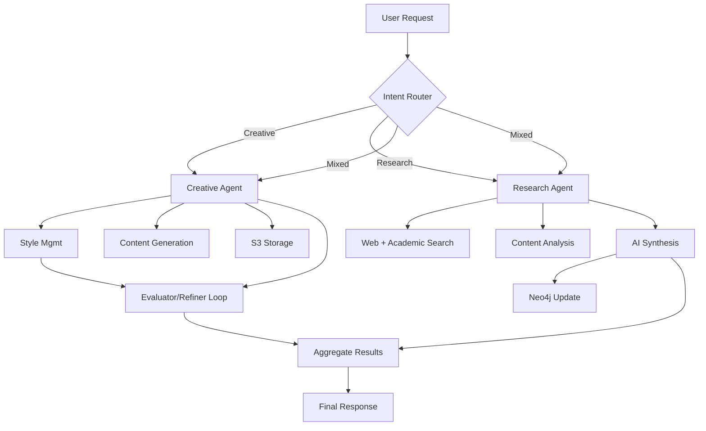

# Master Orchestration Agent

Purpose: a top-level coordinator that routes user intents to specialized agents (Creative, Research), aggregates results, manages context, and handles storage/profile dependencies.

This agent is designed to be the entry point for multi-modal, multi-step workflows, delegating tasks to domain-specific tools and agents.

- Suggested Workflow file: `workflows/master-orchestrator.json` (to be created)
- Proposed Webhook: `POST /webhook/orchestrate`

## High-level Flow



## Responsibilities
- **Normalize & route** incoming tasks (classify intent: research, creative, or composite)
- **Fan-out/fan-in** execution to underlying agents
- **Context management** (session, user, brand profile selection)
- **Storage hooks** (S3) and **profile CRUD** enforcement for creative tasks
- **Aggregation** of results and explanation trace

## Proposed Request
```json
POST /webhook/orchestrate
{
  "intent": "auto|creative|research",
  "payload": {"brief": "...", "query": "..."},
  "profile": {"name": "Acme"},
  "s3": {"preSignedUrl": "https://..."},
  "options": {"explain": true}
}
```

## Proposed Response (shape)
- `status`: ok
- `steps`: execution trace (agent calls and results)
- `result`: merged final result
- `artifacts`: references to stored assets (if any)

## Integration Targets
- Creative: `POST /webhook/creative/compose`
- Research: `POST /webhook/research/query`
- Profiles: `POST /webhook/creative/tools/style-management`
- S3 Helper: `POST /webhook/creative/tools/storage-s3`

## Security & Config
- Use n8n credentials for OpenAI, Postgres, Neo4j, and AWS signer if added
- Inject `sessionId`, `userId` for audit and context

## Recommended Next Steps
- Create `workflows/master-orchestrator.json` with:
  - Webhook + Normalize node
  - Intent classification (AI or rules)
  - Conditional calls to Research/Creative agents
  - Aggregator node to merge outputs
  - Optional S3 upload of final merged result
- Add tests: `tests/workflows/test-master-orchestrator.js` with mock creative and research paths
- Add rate limiting and retry/backoff at orchestration level
- Add Slack/Jira notifier nodes for human-in-the-loop review
- Add analytics: log intent distribution and agent latencies to monitoring stack
